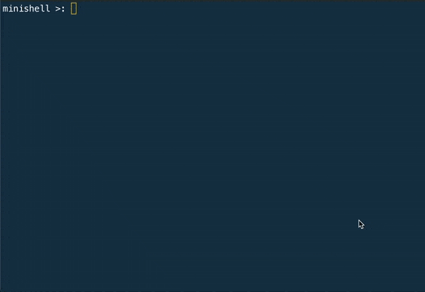

*Minishell*
-----------
Welcome to Minishell, a Hive project that is about creating a minimal version of a Unix shell. This project is an introduction to system programming, focusing on process management, signal handling, and input/output redirection.

🚀 About the Project

The goal of Minishell is to build a functional shell that replicates basic features of popular Unix shells like bash or zsh. It teaches the fundamentals of shell behavior, process creation, and interaction with the operating system.

✨ Features

Command execution: Run commands like ls, pwd, or any executable in your PATH.
Built-in commands: Implemented commands such as:
- echo
- cd
- pwd
- export
- unset
- env
- exit

Pipelines: Chain commands with |, e.g., ls | grep "file" | wc -l.
Redirection:
Output redirection (> and >>)
Input redirection (<)
Signal handling: Handle Ctrl+C, Ctrl+\, and Ctrl+D gracefully.
Environment variables: Use and manage $VARIABLES.

This was a Hive Helsinki group project that I did with [Ville Savolainen](https://www.github.com/svolain)
